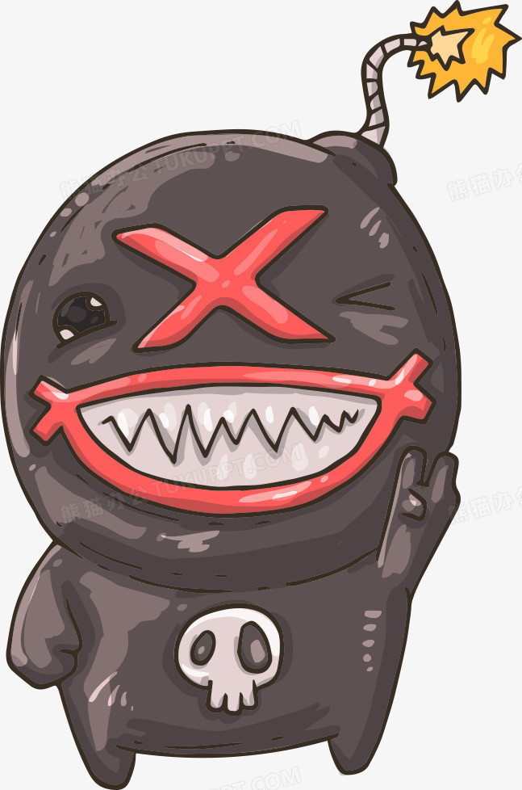
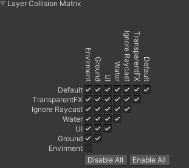
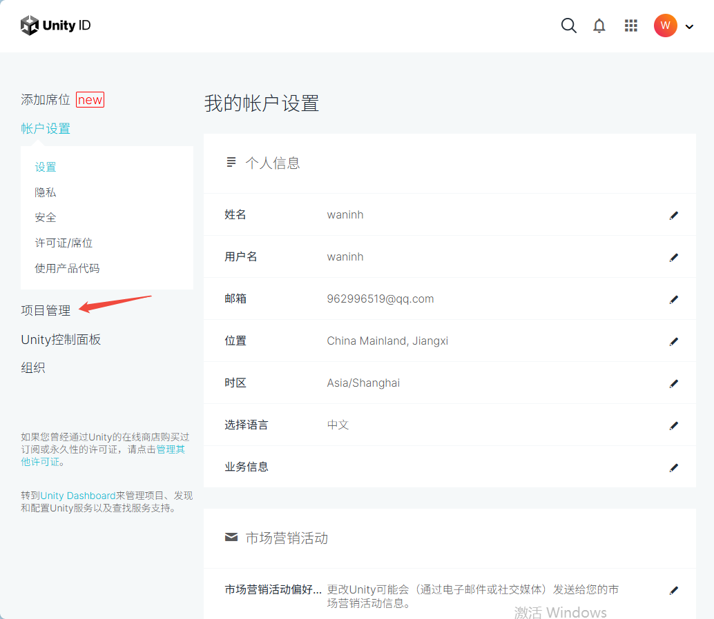
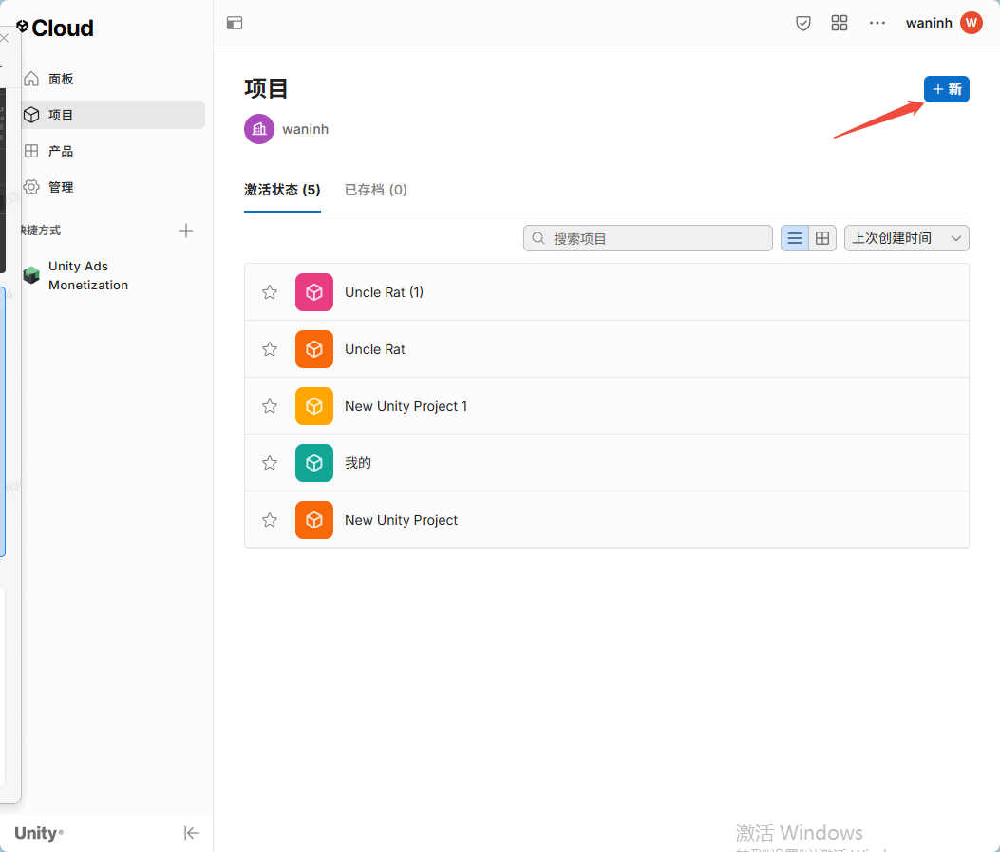
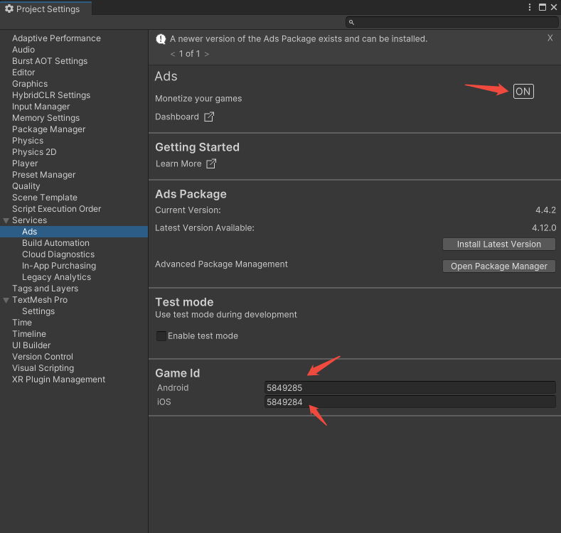
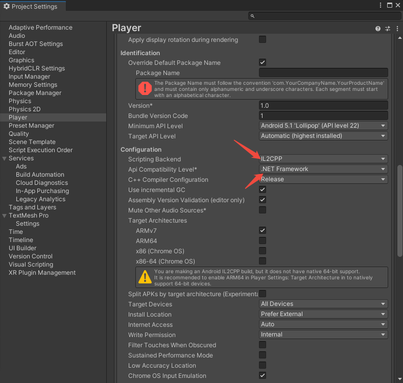
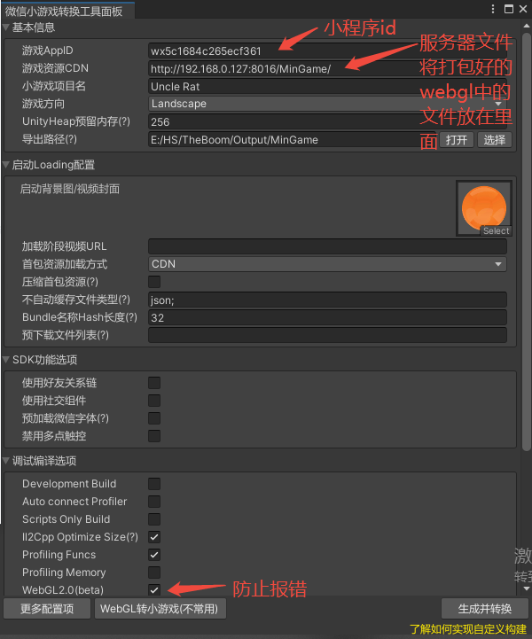

# 说明目录 (问题)
  
克隆链接 https://gitee.com/shushuhs/the-bomber.git  

[URL在线转换](https://www.toolhelper.cn/EncodeDecode/Url?type=1)
[大小写转换](https://app.xunjiepdf.com/yinwen)
- [炸弹人](#%E7%82%B8%E5%BC%B9%E4%BA%BA)  


## 炸弹人



## Code
[code](./Problems-encountered-in-learning/Code-and-image-examples/Chat.cs)

## Tilemap的使用
1. 在Hierarchy面板，右键创建2D Object 中的Tilemap，随便哪个都行

2. 打开window下的Tile Palette面板，点击create，选择文件保存路径，方便整理

3. 将切好的图片拖入面板中，即可绘制场景

4. 高版本的unity中自带Tilemap拓展，低版本需要加载资源包，在以上路径中右键2D->Tiles->Rule Tile
    设置好规则，拖入Tile Palette中，使用Paint a filled box with active brush绘制场景

## [RigBody2D](https://docs.unity.cn/cn/2020.3/Manual/class-Rigidbody2D.html)
1. Body Type 
* Dynamic（动态）：这种类型的刚体受重力和作用力的影响，适用于需要物理模拟的对象。Dynamic 刚体会与所有其他类型的刚体碰撞，是最具互动性的刚体类型。

* Kinematic（运动学）：这种类型的刚体不受重力和作用力的影响，但可以通过脚本精确控制其移动。Kinematic 刚体只会与 Dynamic 刚体碰撞。

* Static（静态）：这种类型的刚体设计为完全不动，主要用于碰撞检测。Static 刚体只能与 Dynamic 刚体碰撞。

* Material（材质）：指定连接到刚体的所有 2D 碰撞体的公共材质。可自行创建材质摩擦力等

* Simulated（模拟）：启用或禁用刚体及其附加组件与物理模拟系统的交互。

* Use Auto Mass（自动质量）：根据附加碰撞体的密度自动计算刚体的质量。

* Mass（质量）：定义刚体的质量。

* Linear Drag（线性阻力）：影响位置移动的阻力系数。

* Angular Drag（角阻力）：影响旋转移动的阻力系数。

* Gravity Scale（重力比例）：定义对象受重力影响的程度。

* Collision Detection（碰撞检测）：定义如何检测碰撞，有 Discrete 和 Continuous 两种模式。

* Sleeping Mode（睡眠模式）：定义对象在静止时如何进入睡眠状态以节省处理器时间。

* Interpolate（插值）：定义在物理更新间隔之间如何插入对象的移动。

* Constraints（约束）：定义对刚体运动的任何限制。

## Layer Collision Matrix(层次碰撞矩阵)
Edit->Project Settings->Physics 2D->Layer Collision Matrix
用于控制不同层次的碰撞体之间是否发生碰撞

如图所示，Envirment与Envirment不会发生碰撞

## Animation
1. 创建动画，需要在哪个物体上创建动画就点击哪个物体，点击创建设置路径
2. 设置动画是否是循环动画，例如idle动画是循环的，jump动画不是，具体情况具体设置

## [Animator](https://docs.unity3d.com/cn/current/Manual/class-Transition.html)
1. Has Exit Time  
 Exit Time 是一种不依赖参数的特殊过渡。但是，它依赖状态的标准化时间。选中此选项可在 Exit Time 指定的具体时间进行过渡。本游戏如何使用的：在敌人到达目的地时让动画完全播放idle动画再转换到巡逻状态，实现停顿效果
2. Exit Time  
如果选中 Has Exit Time__，此值表示过渡可以生效的确切时间。该时间以标准化时间表示（例如，退出时间为 0.75 表示，在已播放 75% 动画的第一帧上，__Exit Time 条件为 true）。在下一帧上，该条件为 false。
对于循环动画，每个循环都会评估退出时间小于 1 的过渡，因此可使用此选项在每个循环的动画中以适当时机对过渡进行计时。
对 Exit Time 大于 1 的过渡仅评估一次，因此此类过渡可用于在固定循环次数后的特定时间退出。例如，过渡的退出时间为 3.5 的情况下，在三个半循环后对该过渡评估一次。
。。。

## 问题
### [Input.GetButtonDwon()、Input.GetAxis("Horizontal")等响应失效。  ](https://blog.csdn.net/crazygougou/article/details/49331591?ops_request_misc=%257B%2522request%255Fid%2522%253A%252277434ccd0a453525e884c8ccdebac16d%2522%252C%2522scm%2522%253A%252220140713.130102334..%2522%257D&request_id=77434ccd0a453525e884c8ccdebac16d&biz_id=0&utm_medium=distribute.pc_search_result.none-task-blog-2~all~sobaiduend~default-2-49331591-null-null.142^v102^pc_search_result_base7&utm_term=unity%20input.getbuttondown%28%29&spm=1018.2226.3001.4187)
Input的操作应该放在Update中而不是FixUpdate   
因为Update跟FixedUpdate的刷新频率不一样，FixedUpdate还没有取到GetButtonDown的值，就被Update先给重置了。
[PlayerContor](.\MyGame\Assets\Scripts\Player\PlayerContor.cs)
```c#
using UnityEngine;
//错误写法
public class Test:MonoBehaviour{
    void FixedUpdate(){
        if(Input.GetKeyDown(KeyCode.Space)){
           //Action
        }
    }
}
```
```c#
using UnityEngine;
//正确写法
public class Test:MonoBehaviour{
    bool action = false;
    void Update(){
         if(Input.GetKeyDown(KeyCode.Space)){
             action = true;
         }
    }
    void FixedUpdate(){
       if(action){
           //Action
           action = false;
        }
    }
}
```
### var horizontal= Input.GetAxis("Horizontal")一直按下无响应
1. 注意[PlayerContor](.\MyGame\Assets\Scripts\Player\PlayerContor.cs)中的物理运算需要和[PlayerAnimation](.\MyGame\Assets\Scripts\Player\PlayerAnimation.cs)中的动画设置在同一个生命周期中
2. 模型卡住， 切换boxcollider，换成capsule collider

## Json保存数据读取数据
1. 在unity包中添加
    "com.unity.nuget.newtonsoft-json": "3.2.1",
2. 使用
```c#
 public override void OnNew()//在单例实例化时读取数据 按钮按下读取（如点击登入游戏时读取）
        {
            if (!File.Exists(JsonDataPath)) return;
            string strjson = File.ReadAllText(JsonDataPath);
            GameGlobalSettings gameGlobalSettings = JsonConvert.DeserializeObject<GameGlobalSettings>(strjson);
            Debug.Log("读取数据！");
            // 使用反射复制所有公共字段
            foreach (var field in typeof(GameGlobalSettings).GetFields())
            {
                field.SetValue(this, field.GetValue(gameGlobalSettings));
            }
        }

 public void Delete()//注销删除游戏配置
        {
            try
            {
                if (File.Exists(JsonDataPath))
                {
                    File.Delete(JsonDataPath);
                    Debug.Log($"已成功删除配置文件：{JsonDataPath}");
            
                    // 可选：重置内存中的数据
                    // ResetToDefaultValues(); 
                }
            }
            catch (System.Exception e)
            {
                Debug.LogError($"配置文件删除失败：{e.GetType().Name} - {e.Message}");
            }
        }

                //保存数据示例 （退出游戏时保存）
                string str= JsonConvert.SerializeObject(GameGlobalSettings.Instance);
                File.WriteAllText(GameGlobalSettings.Instance.JsonDataPath,str);
```
## c#事件
使用c#原生EventHandler
事件[EventManage](./MyGame/Assets/Scripts/Manage/EventManage/EventManage.cs)  


## 对象池
对象池[ObjectPoolManager](./MyGame/Assets/Scripts/Manage/ObjectPoolManager/ObjectPoolManager.cs)  

## 接入Unity广告
搜索Advertisement Legacy包packge,导入项目
去Unity账号上创建项目链接本项目，在本项目中云开发按钮上，打开广告
  

此步骤可能不需要，unity可能会自动创建  



[AdsManage](./MyGame/Assets/Scripts/Manage/AdsManage/AdsManage.cs)  
将此代码在需要加载广告时初始化，也可以开始就初始化，需要填入两个id，上图所标记的id
```c#
using UnityEngine;
using UnityEngine.Advertisements;
 
public class AdsManage : MonoBehaviour, IUnityAdsInitializationListener
{
    [SerializeField] string _androidGameId;//填入上图android id
    [SerializeField] string _iOSGameId;//填入上图iOS id
    [SerializeField] bool _testMode = true;//需要在unity中测试时开启
    private string _gameId;
 
    void Awake()
    {
        InitializeAds();
    }
 
    public void InitializeAds()
    {
#if UNITY_IOS
            _gameId = _iOSGameId;
#elif UNITY_ANDROID
        _gameId = _androidGameId;
#elif UNITY_EDITOR
            _gameId = _androidGameId; //Only for testing the functionality in the Editor
#endif
        if (!Advertisement.isInitialized && Advertisement.isSupported)
        {
            Advertisement.Initialize(_gameId, _testMode, this);
        }
    }

 
    public void OnInitializationComplete()//初始化成功回调
    {
        Debug.Log("Unity Ads initialization complete.");
    }
 
    public void OnInitializationFailed(UnityAdsInitializationError error, string message)//初始化失败回调
    {
        Debug.Log($"Unity Ads Initialization Failed: {error.ToString()} - {message}");
    }
}
```
第一种可跳过广告[AdsManageDemo](./MyGame/Assets/Scripts/Manage/AdsManage/AdsManageDemo.cs)  

第二种不可跳过广告，奖励广告[SureButtonAds](./MyGame/Assets/Scripts/Manage/AdsManage/SureButtonAds.cs)  

第三种横幅广告[SureButtonAds](./MyGame/Assets/Scripts/Manage/AdsManage/BannerAds.cs)  （打包后可能加载不出来，因为地区广告资源的原因，是正常现象）


# HybirdCLR YooAsset

将项目设置为IL2CPP 


## HybirdCLR url链接
https://gitee.com/focus-creative-games/hybridclr_unity.git

Name: package.openupm.com
URL: https://package.openupm.com
Scope(s): com.tuyoogame.yooasset


``` c#
//YooAsset Exception: ResourcePackage is initialized yet. 
//在重新加载场景时，yooasset不能正常初始化
//原因未知  解决方法 
//将报错代码设为
DontDestroyOnLoad(this);
//添加切换场景事件 
SceneManager.sceneLoaded += OnSceneloaded;
//方法中添加控制条件
private void OnSceneloaded(Scene arg0, LoadSceneMode arg1)
    {
        if (GameGlobalSettings.Instance.State == 1)
            StartGame();
    }
//回调方法中StartGame不运行 解决方法
//修改为
private void OnSceneloaded(Scene arg0, LoadSceneMode arg1)
    {
        StopAllCoroutines();
        ShowText("场景切换");
        if (GameGlobalSettings.Instance.State == 1)
        {
            ShowText("场景切换1111");
            url.gameObject.SetActive(false);
            update.gameObject.SetActive(false);
            // StartGame();
            StartCoroutine(Run_InstantiateComponentByAsset());
        }
    }
```

> 热更新测试 开启HFS将文件夹Android拖入 打开start界面的url输入框 填入url 点击Update按钮，显示运行热更新代码则成功热更新 开始新游戏会有两个敌人，正常时是只有一个敌人  

[LoadDll](./MyGame/Assets/Scripts/Test/LoadDll.cs)
```c#
 private string GetHostServerURL()
    {
        if (url == null)
            return null;
        //模拟下载地址，8016为HFS或Nginx里面设置的端口号，项目名，平台名
        return $"https://{url.text}/Android";
    }
```

## webgl转换为微信小程序
[借鉴文章](https://blog.csdn.net/lengyoumo/article/details/134271739?ops_request_misc=%257B%2522request%255Fid%2522%253A%2522b5a8e6cdb3b111b21523a3743e237fe4%2522%252C%2522scm%2522%253A%252220140713.130102334.pc%255Fall.%2522%257D&request_id=b5a8e6cdb3b111b21523a3743e237fe4&biz_id=0&utm_medium=distribute.pc_search_result.none-task-blog-2~all~first_rank_ecpm_v1~hot_rank-1-134271739-null-null.142^v102^pc_search_result_base7&utm_term=unity%E8%BD%AC%E5%BE%AE%E4%BF%A1%E5%B0%8F%E6%B8%B8%E6%88%8F&spm=1018.2226.3001.4187)  

[Unity包下载](
https://res.wx.qq.com/wechatgame/product/wasm_plugin/minigame.202505120809.unitypackage#0.1.27)  

下载微信开发者工具  



微信开发者工具可能报错
1. appid转换错误，需要登入，不能游客登入
2. 微信小程序下载基础库版本xxx失败,去下载老版本，新版本可能有问题